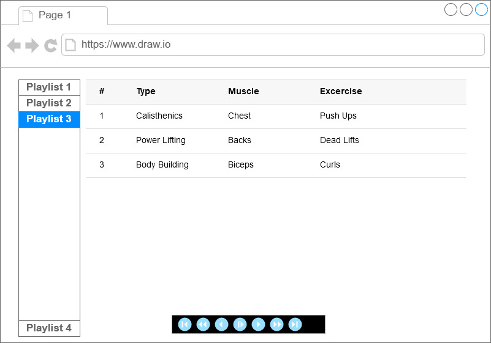
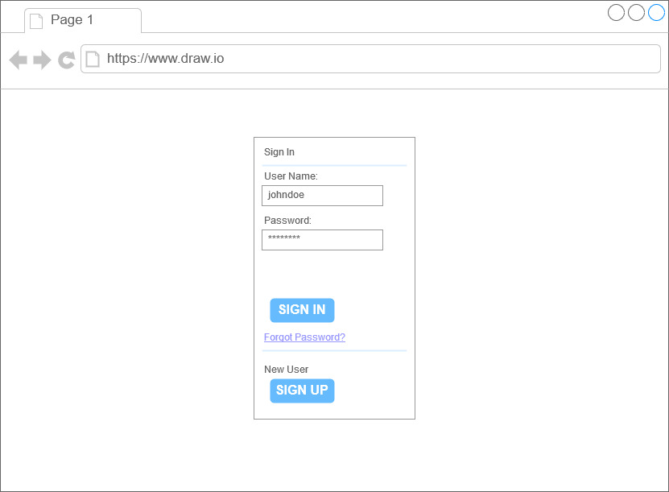
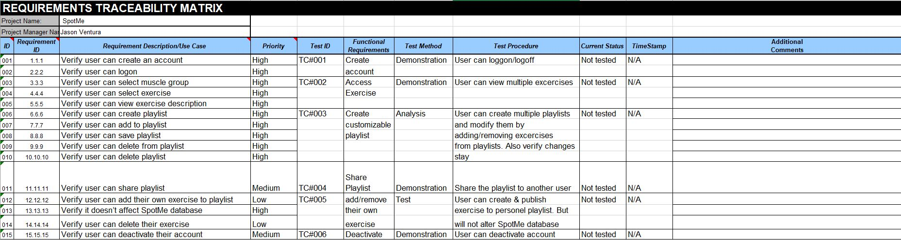

 





Just a sample database for my project
````
--Project Step 5

---------------Creating the database-------------------------------------------------------
DROP DATABASE IF EXISTS SpotMe;
CREATE DATABASE SpotMe;
USE SpotMe;
---------------Creating the Playlist table----------------------------------------------------

DROP TABLE IF EXISTS Playlist
CREATE TABLE Playlist
(
  playlistid       INT                   NOT NULL
  ,userid          INT                   NOT NULL
  ,playlistname    VARCHAR(20)           NOT NULL
  ,excercise       VARCHAR(50)           NOT NULL
  ,playlistdate    DATE                  NOT NULL
  ,lastexcercise   VARCHAR(50)               NULL
  ,nextexcercise   VARCHAR(50)               NULL 
  ,CONSTRAINT PK_PlayList PRIMARY KEY (playlistid)
)
----------------Creating the Excerciser table---------------------------------------------------
USE SpotMe;
DROP TABLE IF EXISTS Excerciser
CREATE TABLE Excerciser
(
  userid           INT                   NOT NULL
  ,playlistid      INT                   NOT NULL 
  ,firstname       NVARCHAR(20)          NOT NULL
  ,lastname        NVARCHAR(20)          NOT NULL
  ,email           VARCHAR(30)           NOT NULL  
  ,username        NVARCHAR(30)          NOT NULL
  ,userpassword    NVARCHAR(30)          NOT NULL
  ,CONSTRAINT PK_Excerciser PRIMARY KEY (userid)
)
----------------Creating the Muscle table------------------------------------------------------
USE SpotMe;
DROP TABLE IF EXISTS Muscle
CREATE TABLE Muscle
(
   muscleid        INT                   NOT NULL  
  ,chest           VARCHAR(50)           NOT NULL
  ,triceps         VARCHAR(50)           NOT NULL
  ,biceps          VARCHAR(50)           NOT NULL
  ,quadrecips      VARCHAR(50)           NOT NULL
  ,hamstrings      VARCHAR(50)           NOT NULL
  ,calves          VARCHAR(50)           NOT NULL
  ,shoulders       VARCHAR(50)           NOT NULL
  ,playlistid      INT                   NOT NULL
  ,userid          INT                   NOT NULL 
  ,CONSTRAINT PK_Muscle PRIMARY KEY (muscleid)
  ,FOREIGN KEY  (playlistid) REFERENCES Playlist   (playlistid)
  ,FOREIGN KEY  (userid)     REFERENCES Excerciser (userid)
)
----------------Adding data to Playlist table-----------------------------------------------
USE SpotMe;
INSERT INTO Playlist
(playlistid, userid, playlistname, excercise, lastexcercise, nextexcercise, playlistdate)
VALUES
(1, 1001, 'Gainz Train', 'PushUps', 'Squats', 'Lunges', '2019-05-05')
,(2, 1002, 'Swole City', 'Bench', 'Deadlift', 'PullUps', '2019-04-02') 
,(3, 1003, 'Iron Nation', 'Bicep Curls', 'Rack Pulls', 'Shoulder Press', '2019-04-02') 
SELECT *
FROM Playlist
-----------------Adding data to Excerciser table---------------------------------------------
INSERT INTO Excerciser
(userid, playlistid, firstname, lastname, email, username, userpassword)
VALUES
(1001, 1, 'Kyle', 'Monster', 'KMonster@gmail.com', 'KYLE1994', 'password123')
,(1002, 2, 'Chad', 'Brad', 'bestAteverything@gmail.com', 'Chab!', '321pass')
,(1003, 3, 'Jose', 'Rodriguez', 'thechosenJuan@gmail.com', 'Juan', 'queso')
------------------Adding data to Muscle table----------------------------------------------------------------------------------
INSERT INTO Muscle
(muscleid, chest, triceps, biceps, quadrecips, hamstrings, calves, shoulders, playlistid, userid)
VALUES
(101, 'Pushups', 'Dips', 'Bicep Curls', 'Leg Extensions','Hamstring Curls ', 'Calve Raises', 'Shoulder Press Dumbell',1, 1001) 
,(102, 'Flat Bench', 'Tricep Extension', 'Hammer Curls', 'Box Jumps','Hamstring Extensions ', 'Single leg Calve Raises', 'Shoulder Press Barbell',2, 1002) 
,(103, 'Incline Bench', 'Overhead Tricep Extension', 'Preacher Curls', 'Star Jumos','Hamstring lifts ', 'Weighted Calve Raises', 'Shoulder Press Kettbell',3, 1003) 

SELECT*
FROM Muscle;

````
